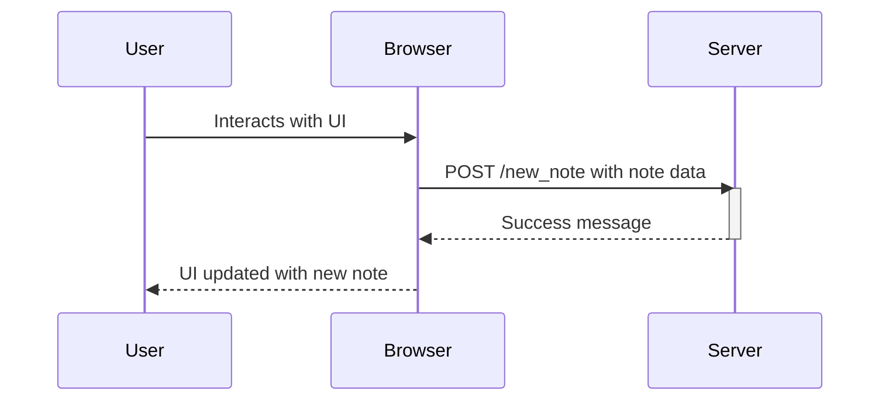

**exercise 0.4 in fullstackopen**

```mermaid
sequenceDiagram
    participant User
    participant Browser
    participant Server

    User->>Browser: Interacts with UI
    Browser->>Server: POST /new_note with note data
    activate Server
    Server-->>Browser: Success message
    deactivate Server
    Browser-->>User: UI updated with new note
```