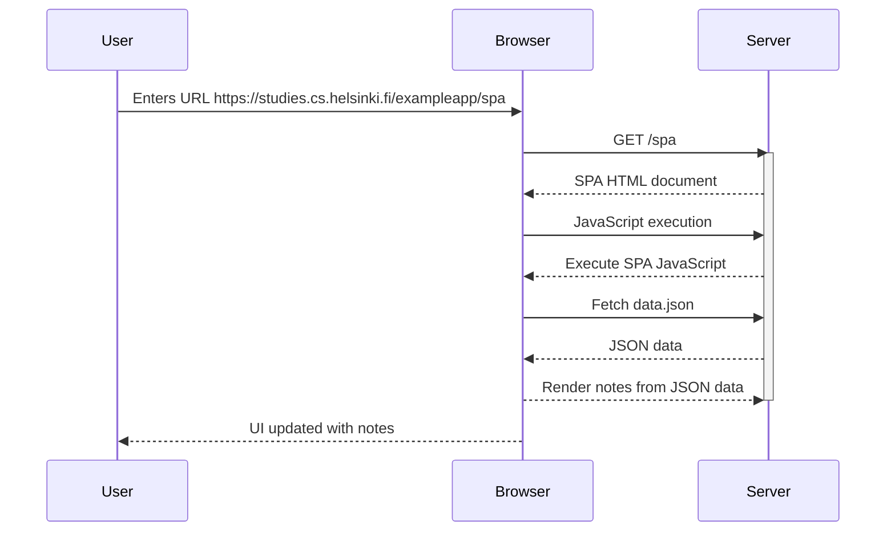

```mermaid
sequenceDiagram
    participant User
    participant Browser
    participant Server

    User->>Browser: Enters URL https://studies.cs.helsinki.fi/exampleapp/spa
    Browser->>Server: GET /spa
    activate Server
    Server-->>Browser: SPA HTML document
    Browser->>Server: JavaScript execution
    Server-->>Browser: Execute SPA JavaScript
    Browser->>Server: Fetch data.json
    Server-->>Browser: JSON data
    Browser-->>Server: Render notes from JSON data
    deactivate Server
    Browser-->>User: UI updated with notes
```