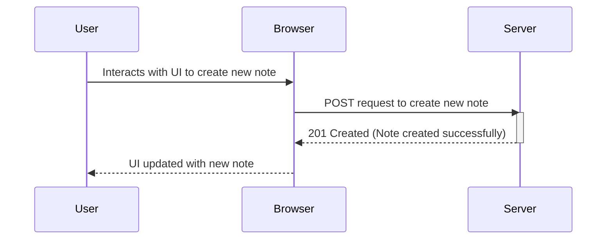

```mermaid
sequenceDiagram
    participant User
    participant Browser
    participant Server

    User->>Browser: Interacts with UI to create new note
    Browser->>Server: POST request to create new note
    activate Server
    Server-->>Browser: 201 Created (Note created successfully)
    deactivate Server
    Browser-->>User: UI updated with new note   
```